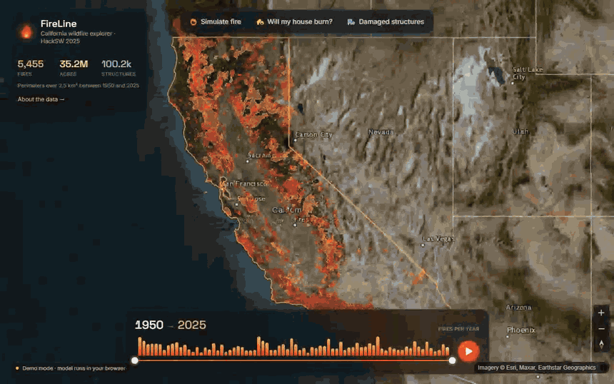
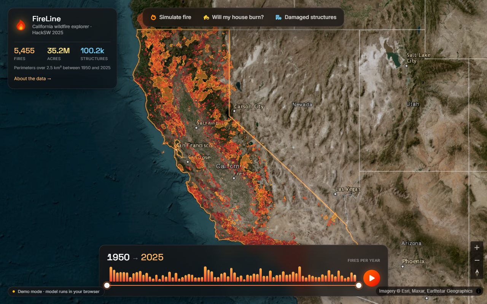
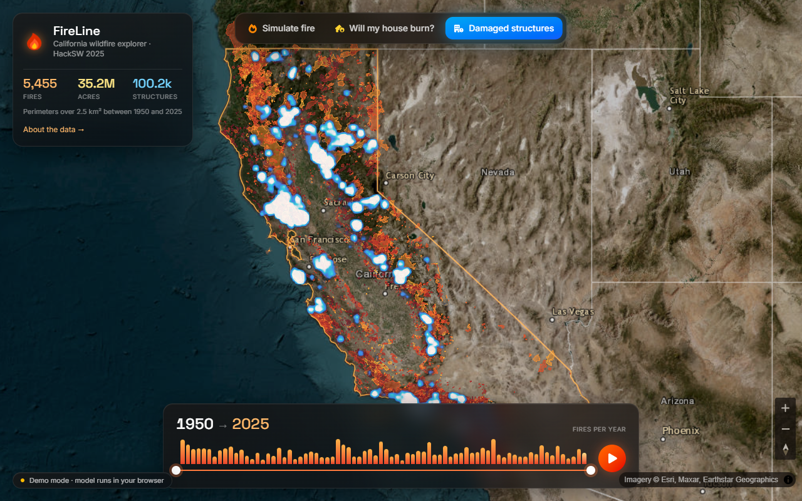
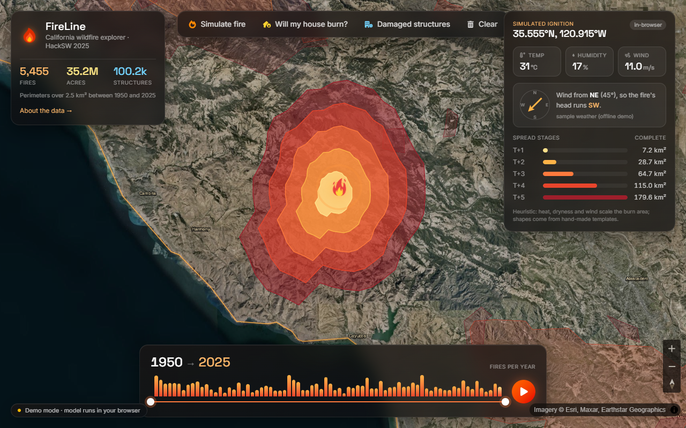
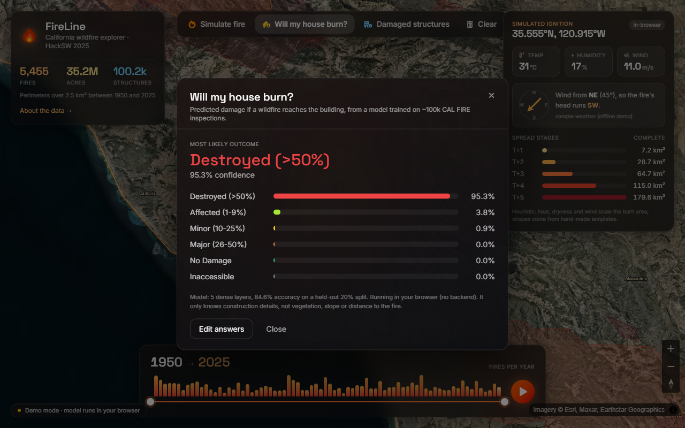
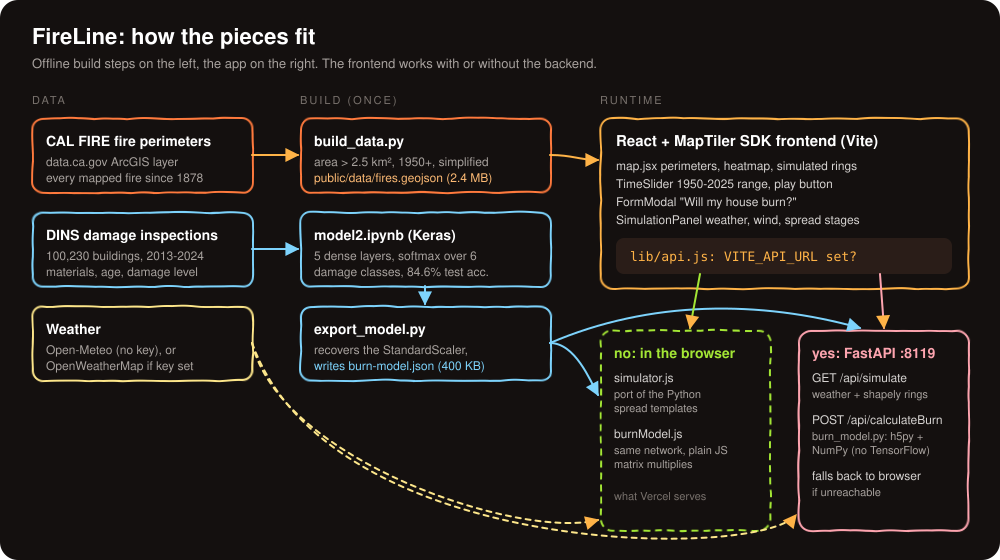
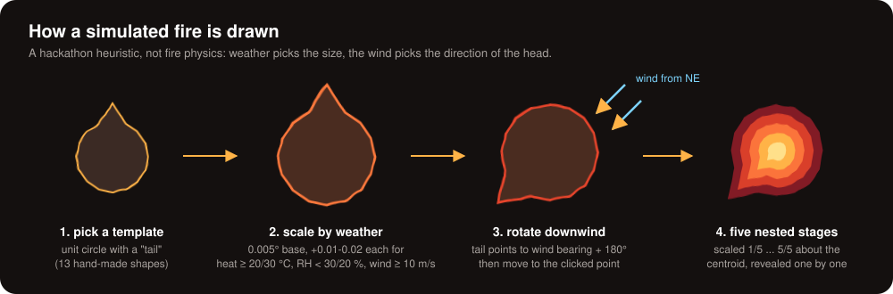

# FireLine

Explore 70 years of California wildfires on a satellite map, start a simulated fire anywhere and watch it spread with live weather, and ask a small neural network how a given house would fare. Built in a day at **HackSW 2025** (February 2025).



([MP4 version](docs/media/demo.mp4))

> This is a hackathon project. The fire-spread model is a heuristic, and the house model learned from inspection records, not fire physics. It is a data-visualisation demo, not a safety tool.

## What it does

| | |
|---|---|
|  | **Historic perimeters.** About 5,500 CAL FIRE fire perimeters (over 2.5 km², 1950 to 2025), coloured by year. Hover for the fire's name, year and acreage. The timeline shows fires per year; drag the range or press play to watch them accumulate. |
|  | **Damaged structures.** 100,230 buildings inspected by CAL FIRE after fires between 2013 and 2024, as a heatmap when zoomed out and dots when zoomed in. |
|  | **Simulate a fire.** Click *Simulate fire*, then click the map. The app fetches the current weather at that point, sizes the fire from temperature, humidity and wind speed, points its head downwind, and reveals five spread stages. |
|  | **Will my house burn?** Describe a building (roof, siding, eaves, windows, fences, age, CAL FIRE unit) and a Keras model trained on the inspection records predicts the damage class, with the full probability breakdown. |

## How it works



The frontend runs either way:

- **Demo mode (default, and what a static Vercel deploy serves).** Everything runs in the browser. Satellite tiles come from Esri World Imagery, weather from Open-Meteo (no key needed, with a built-in "Santa Ana day" sample if the request fails), the spread simulation is a JavaScript port of the Python one, and the neural network runs as plain JavaScript matrix multiplies over weights exported from the `.h5` file.
- **With the backend.** Set `VITE_API_URL` and the same requests go to the FastAPI service, which does the weather lookup, the shapely geometry and the model inference in Python. If the backend is unreachable the frontend falls back to demo mode.

### The spread simulation



### The damage model

`californa-juypter/model2.ipynb` label-encodes ten categorical columns (street type, CAL FIRE unit, structure type and category, roof, eaves, siding, windows, patio, fence), adds the building's age at the time of the fire, standardises the features and trains a 256-128-64-32-16 dense network with batch norm and dropout. It reaches 84.6% accuracy on the held-out 20% split.

## Quick start

Frontend only (this is all you need to try it):

```bash
cd Frontend
npm install
npm run dev          # http://localhost:8118
```

With the backend (Python 3.10+, run from the repo root):

```bash
pip install -r backend/requirements.txt
python -m uvicorn backend.main:app --port 8119

# in another terminal
cd Frontend
echo VITE_API_URL=http://localhost:8119 > .env.local
npm run dev
```

Optional settings (see `Frontend/.env.example` and `backend/weather_service.py`):

| Variable | Where | Effect |
|---|---|---|
| `VITE_MAPTILER_KEY` | frontend | use MapTiler's satellite style instead of the keyless Esri tiles |
| `VITE_API_URL` | frontend | send simulations and predictions to the FastAPI backend |
| `OPENWEATHER_API_KEY` | backend | use OpenWeatherMap instead of Open-Meteo |
| `CORS_ORIGINS` | backend | comma-separated allowed origins (default `*`) |

Add `?demo` to the URL to force the sample weather, which makes the simulation repeatable.

Rebuilding the data files (only needed for fresher perimeters or a retrained model):

```bash
python Frontend/data/build_data.py   # public/data/fires.geojson + structures.json
python backend/export_model.py       # backend/scaler.json + public/model/burn-model.json
```

### Deploying the frontend to Vercel

Root directory `Frontend`, framework preset Vite, build command `npm run build`, output directory `dist`. No environment variables are required; `VITE_MAPTILER_KEY` and `VITE_API_URL` are optional. `Frontend/vercel.json` holds the same settings plus an SPA rewrite.

## Project layout

```
Frontend/                 React + Vite + Tailwind + MapTiler SDK
  src/Components/         map, overlay panels, timeline, house form
  src/lib/                api switch, in-browser simulator and model, map style
  public/data/            fire perimeters and damaged-structure points (static)
  public/model/           exported network weights + scaler + label mappings
  data/                   build_data.py, the original hackathon data scripts, raw structure points
backend/                  FastAPI service
  main.py                 /api/simulate, /api/simulatePoints, /api/calculateBurn
  burn_model.py           NumPy forward pass over sequential-model-2.h5
  burn_simulator_service.py, weather_service.py, mapping.py
  export_model.py         recovers the scaler, exports weights for the browser
californa-juypter/        notebooks and CSVs used to explore the data and train the model
docs/hackathon/           the build log, pitch thread and data links from the day
docs/media/               demo recording, screenshots, diagrams
```

## What was built on the day

From the team's [build log](docs/hackathon/log.md): about an hour and a half of brainstorming, two hours hunting for data (the fire perimeter GeoJSON was the big find), then ten-plus hours of parallel work. One half built the React/MapTiler map with the perimeter overlay and time slider; the other cleaned the CAL FIRE inspection data and trained the Keras model behind a FastAPI endpoint. The two halves were merged around 10pm, and the last two hours went on UX and extras like the play button. The pitch ([tweet thread](docs/hackathon/tweet.txt)) also talked about storing data on Solana; that part never made it into the code.

## Cleaned up afterwards

The hackathon version needed a lot of local state to run. Tidying it into something anyone can open also turned up some real bugs:

- **The model was fed unscaled inputs.** The notebook trained on `StandardScaler` output but never saved the scaler, so the API passed raw label indices into the network: 46% accuracy on the test split instead of 84.6%. `export_model.py` recovers the scaler by re-running the notebook's exact split.
- **Label mappings were off.** The damage labels had been renamed by hand (class 5 is "Inaccessible", not "Totally Destroyed") and the street-type indices were shifted by one after "Parkway".
- **Simulator bugs:** `scale_factor =+ random...` discarded the weather-based size, `randint(1, len(TEMPLATES))` could pick template 10 (which does not exist), the humidity thresholds were reversed, and the fire's tail pointed along the raw wind-from angle rather than downwind.
- **It depended on TensorFlow and on files that were never committed.** The backend now reads the `.h5` with h5py and runs the network in NumPy. The fire perimeter file was gitignored, so a fresh clone could not build; it is now generated by `build_data.py` and committed.
- **API keys were committed.** A MapTiler key and an OpenWeatherMap key were hard-coded, and `Frontend/.env` was tracked. They are gone from the current tree and replaced by optional environment variables, but they are still in git history and should be rotated.
- A visual redesign of the whole overlay (panels, timeline histogram, simulation readout, prediction breakdown), keyless map tiles, and the in-browser fallback so the site can be hosted statically.

## What I'd do next

- Replace the template shapes with a real spread model (Rothermel-style rate of spread with slope and fuel type), or at least use wind speed for elongation rather than just size.
- Retrain the damage model with location, distance to the perimeter and vegetation. It currently leans on how inspectors recorded fields (for example, "Unknown" values are far more common on destroyed buildings) as much as on construction.
- Let users drop a pin on their address and fill in the CAL FIRE unit and street type automatically.
- Serve perimeters as vector tiles instead of a 2.4 MB GeoJSON.

## Team

Built at HackSW 2025 by:

- Jeremy Shorter
- Adam O'neill
- Thomas Nguyen
- Henry Tran
- Lorenzo Satta Chiris ([@LorenzoSattaChiris](https://github.com/LorenzoSattaChiris))

Repository published by [@duc-minh-droid](https://github.com/duc-minh-droid).

Data: CAL FIRE historic fire perimeters and Damage Inspection (DINS) records via [data.ca.gov](https://data.ca.gov/group/fire). Weather: [Open-Meteo](https://open-meteo.com). Imagery: Esri World Imagery.

## License

Proprietary, see [LICENSE.txt](LICENSE.txt).
